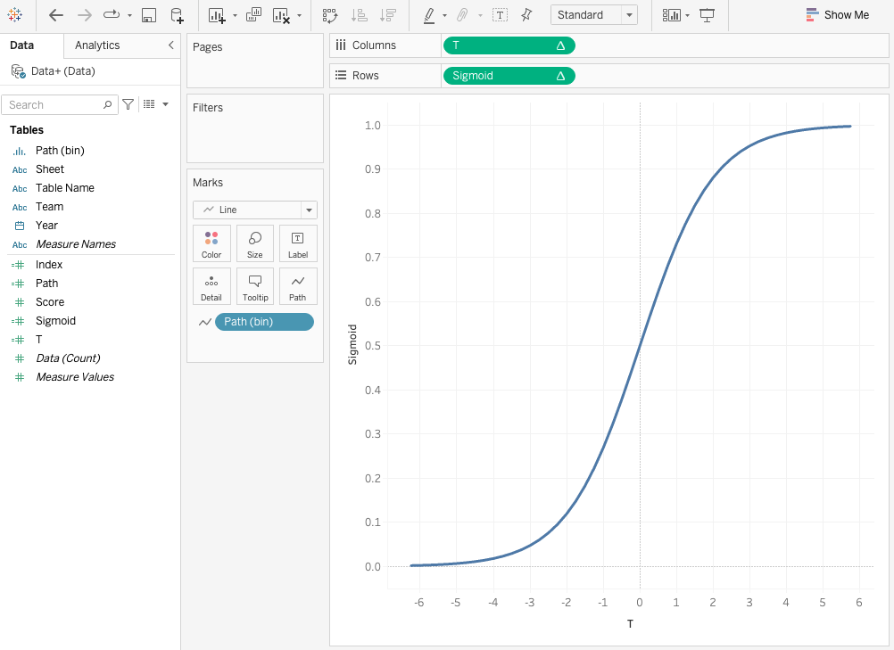

Are you left scratching your head over the title of this post and what it means? Well, so was I, until I had a use-case that was solved using the brilliant and rarely used __Curvy Bump Chart__. The use case was to visualize the ranking of different teams of the IPL Cricket tournament and to show their rise and fall over the years.

If I have pique your interest then keep on reading because I will not only be breaking down the simple concept behind the Curvy Bump Chart but will also be giving a thorough walkthrough on how you can recreate the chart yourself.

## What is a Bump Chart?
To begin with, a __Bump Chart__ shows how rankings change over time. This visualization is not only easy to understand, but also quick to create. In the following visual we are using a simple Bump Chart to easily and visually track the ranking of a team with a line that connects the team across the time periods.


Unfortunately, the Cons of the Bump Chart happen to be equally discouraging for it to be implemented. From the following visual, with the increase in the number of data points it gets really hard to keep a track of a team's ranking over the years and the visual eventually looks busy with lines cutting across empty spaces.


In such case, a __Curvy Bump Chart__ might be more visually appealing and also give more flexibility to present additional data attributes that a Bump Chart might not be successful at.

*Check out the above viz on Tableau Public https://public.tableau.com/app/profile/akruti.ambade/viz/IPLPlayoffs/Dashboard*

This visualization and tutorial was inspired by Tableau Zen Master Toan Hoang's [tutorial](https://tableau.toanhoang.com/tableau-magic-epicviz-vol-1/) where he has succinctly explained a rather complex visual.

## Walkthrough
{}

### Get Data

Let's start with some sample data of team performances over the years. Create an Excel spreadsheet and add the following data into a tab named `Data`.

| Year     | Team   | Score |
|----------|--------|-------|
| 1/1/2020 | Team A | 800   |
| 1/1/2020 | Team B | 500   |
| 1/1/2020 | Team C | 300   |
| 1/1/2021 | Team A | 600   |
| 1/1/2021 | Team B | 900   |
| 1/1/2021 | Team C | 200   |
| 1/1/2022 | Team A | 500   |
| 1/1/2022 | Team B | 400   |
| 1/1/2022 | Team C | 1000  |

### Connect Data

Open up Tableau Desktop and connect to the spreadsheet in the `Data Source` page. Once the connection is done, drag the `Data` sheet from the left pane into the `Canvas`. The `Canvas` will now show the `Data` table which is at the logical layer. Double-click on the `Data` table to go to the physical layer of the canvas.

In this physical layer, we will be performing a Union of the data with itself. Now, drag the `Data` sheet from the left pane again to the bottom of the `Data` table until you see the `Drag table to union` option visible. Once visible, release the sheet to complete the Union.

After this task is done, you will see the `Data grid` showing the following result of the union along with two new columns added named `Sheet` and `Table Name`. The `Table Name` column will have two unique values `Data` and `Data1` to showcase the two sets of data that are part of the Union.

| Year     | Team   | Score | Sheet | Table Name |
|----------|--------|-------|-------|------------|
| 1/1/2020 | Team A |   800 | Data  | Data       |
| 1/1/2020 | Team B |   500 | Data  | Data       |
| 1/1/2020 | Team C |   300 | Data  | Data       |
| 1/1/2021 | Team A |   600 | Data  | Data       |
| 1/1/2021 | Team B |   900 | Data  | Data       |
| 1/1/2021 | Team C |   200 | Data  | Data       |
| 1/1/2022 | Team A |   500 | Data  | Data       |
| 1/1/2022 | Team B |   400 | Data  | Data       |
| 1/1/2022 | Team C |  1000 | Data  | Data       |
| 1/1/2020 | Team A |   800 | Data  | Data1      |
| 1/1/2020 | Team B |   500 | Data  | Data1      |
| 1/1/2020 | Team C |   300 | Data  | Data1      |
| 1/1/2021 | Team A |   600 | Data  | Data1      |
| 1/1/2021 | Team B |   900 | Data  | Data1      |
| 1/1/2021 | Team C |   200 | Data  | Data1      |
| 1/1/2022 | Team A |   500 | Data  | Data1      |
| 1/1/2022 | Team B |   400 | Data  | Data1      |
| 1/1/2022 | Team C |  1000 | Data  | Data1      |


  Check the official Tableau documentation to learn more about the [Data Source Page](https://help.tableau.com/current/pro/desktop/en-us/environment_datasource_page.htm).


### Plot Basic Sigmoid graph

Before we dive deep into the chart, we will create a basic sigmoid graph. A sigmoid function is a mathematical function whose graph has a characteristic S-shaped or sigmoid curve. The mathematical formula for a Sigmoid is as follows,

$$
\sigma(x) = \frac{1}{1 + e^{-x}}
$$

Let's create the following calculated fields to recreate the above Sigmoid function in Tableau,

```{filename="Path"}
IF [Table Name] = 'Data' THEN 1
ELSE 49
END
```

```{filename="Index"}
INDEX()-1
```

```{filename="T"}
([Index]-25)/4
```

```{filename="Sigmoid"}
1/(1+EXP(-[T]))
```

Steps to create the basic sigmoid graph,
1. Right-click on the `Path` field and then select `Create` and `Bins...`.
2. In the `Edit Bins [Path]` pop-up menu, edit the `Size of bins` to `1` and select `OK` to close the menu.
3. Drag the newly created `Path (bin)` dimension onto the Rows shelf.
4. Right-click on the `Path (bin)` pill in the Rows shelf and make sure the `Show Missing Values` option is selected.
5. In the `Marks` card, change the Mark Type selection from `Automatic` to `Line`.
6. Drag the `Path (bin)` pill from the Rows shelf into the `Path` mark in the `Marks` card.
7. Drag the `T` measure onto the Columns shelf, and right-click on the pill and select `Compute Using` > `Path (bin)`.
8. Drag the `Sigmoid` measure onto the Rows shelf, and right-click on the pill and select `Compute Using` > `Path (bin)`.



We now have created our basic Sigmoid graph, that resembles an S-curve. Here we have used the [Data Densification](https://www.flerlagetwins.com/2019/05/intro-to-data-densification.html) technique to add more data points using the `Path` dimension and the `Show Missing Values` feature to create a smooth curve.

### Modify Sigmoid Graph

Now we are going to use some math and modify the Sigmoid function to slightly change the appearance of the graph. Update the following two existing calculated fields,

```{filename="Path"}
IF [Table Name] = 'Data' THEN 1
ELSE 201
END
```

```{filename="T"}
(-6+([Index]-151)*6/25)
```


With the update, we have added additional data points to elongate the tail on the bottom left-hand side and accommodate a rounded bar chart that will overlap on the curve.

### Create Calculated Fields and Parameter

We are now stepping into advance level of this visualization, for which we will need to create the following,

#### Parameter

Create a parameter named `Distance` with the `Data type` as `Integer` and `Current value` as `19`.

#### Calculated Fields

```{filename="Last"}
LAST()
```

```{filename="Value"}
WINDOW_MAX(MAX([Score]))
```

```{filename="Max Value"}
WINDOW_MAX(MAX([Score]))
```

```{filename="Percentage"}
[Value]/[Max Value]*100
```

```{filename="Current Position"}
RANK_UNIQUE([Value],"desc")
```

```{filename="Next Position"}
LOOKUP([Current Position], 1)
```

```{filename="Size"}
IF [Index] < [Percentage] + [Distance] AND [Index] > [Distance] THEN 1
ELSE 0
END
```

```{filename="Multiplier"}
IF [Last]=0 THEN 0
ELSE ZN([Next Position]) - ZN([Current Position])
END
```

```{filename="Rank"}
IF [Index] < 151 THEN RANK_UNIQUE ([Value])
ELSE RANK_UNIQUE([Value]) + ([Sigmoid] * [Multiplier])
END
```

### Create Ranked Rounded Bar Chart
We will now create a Ranked Rounded Bar chart for our visual to arrange the score as per Rank.

1. In the Columns shelf, replace `T` with `Index`, and right-click on the pill and select `Compute Using` > `Path (bin)`.
2. In the Rows shelf, replace `Sigmoid` with `Rank`, and right-click on the pill and select `Compute Using` > `Path (bin)`.
3. Drag the `Year` dimension onto the Columns shelf, and right-click and make sure it is selected as `Discrete`.
4. Drag the `Team` dimension into the `Color` section on the `Marks` card.
5. Right-click on `Rank` in the Rows shelf, and go to `Edit Table Calculations`
    - In the `Nested Calculations` dropdown, select `Rank`.
    - Set `Compute Using` to `Specific Dimensions`.
    - Ensure that only `Year of Year` and `Team` are selected below.
    - Arrange the order to `Year of Year` at the top, and `Team` below that.
    - In the `Restarting every` menu, select `Year of Year`.
    - In the `Nested Calculations` dropdown, select `Last`.
    - Set `Compute Using` to `Specific Dimensions`.
    - Uncheck all options in the `Specific Dimensions` sub-menu below.
6. Drag the `Size` measure to the `Size` section in the `Marks` card and,
    - Right-click on the `Size` pill and select `Compute Using` > `Path (bin)`.
    - Right-click on the `Size` pill again and go to `Edit Table Calculations`.
    - In the `Nested Calculations` dropdown, select `Max Value`.
    - Set `Compute Using` to `Specific Dimensions`.
    - Make sure to check only `Year of Year`, `Team` and `Path (bin)`.
    - Rearrange the order to `Year of Year`, `Team` and `Path (bin)`.
7. Right-click on the `Rank` axis of the visualization and then `Edit Axis...`,
    - In the `Scale` section, select the `Reversed` option.
    - Close the `Edit Axis` menu.


In the above chart, the Teams are now properly ranked for each Year from top to bottom, with the length of the bar being a percentage of the Score compared to the Maximum Score in the dataset.

### Create Curvy Bump Chart
Now that we have created the Sigmoid graph and Ranked Rounded Bar chart, we are going to link them up together to make our final visualization.

To combine them, Right-click on `Rank` pill on the Rows shelf and go to `Edit Table Calculations`
1. In the `Nested Calculations` dropdown, select `Next Position`.
    - Set `Compute Using` to `Specific Dimensions`.
    - Ensure that only `Team` and `Year of Year` are checked.
    - Arrange the order with `Team` at the top.
2. In the `Nested Calculations` dropdown, select `Current Position`.
    - Set `Compute Using` to `Specific Dimensions`.
    - Ensure that only `Team` and `Year of Year` are checked.
    - Arrange the order with `Year of Year` at the top.
    - In the `Restarting every` menu, select `Year of Year`.
3. In the `Nested Calculations` dropdown, select `Last`.
    - Set `Compute Using` to `Table (across)`.
    - Close the `Table Calculation` menu.

We can additionally add custom shapes to the beginning of the bar chart to uniquely identify the teams. To achieve this,
1. Create the following Calculated Field to represent team logos in the visual.
```{filename="Logo"}
IF ATTR([Path]) = 1 THEN [Current Position]
END
```
2. Drag the `Logo` measure to the Rows shelf and drop it next to the `Rank` pill.
3. Right-click on the `Logo` pill and go to `Edit Table Calculations`.
    - In the `Nested Calculations` dropdown, select `Current Position`.
    - Set `Compute Using` to `Specific Dimensions`.
    - Ensure that only `Team` and `Year of Year` are checked.
    - Arrange the order with `Year of Year` at the top.
    - In the `Restarting every` menu, select `Year of Year`.
4. Right-click on `Logo` pill on the Rows Shelf and select `Dual Axis`.
5. On the right of the visualization you will see an axis for `Logo`,
    - Right-click on the axis and select `Synchronize Axis` to align both the axes.
5. Go to the `Marks` card section and open up `Logo` mark card,
    - Remove the `Size` pill.
    - In the Mark Type dropdown selection, select `Shape`.
    - Drag the `Team` pill from the Logo mark card into the `Shape`, to change the Logo mark type to shape.


Although, it looks a bit messy, we have finally created a Curvy Bump Chart.

### Cleanup
For our final step, we are going clean up the visualization.

1. Right-click on the `Index` axis at the bottom and then `Edit Axis...`
    - In the pop-up menu, for the `Range` select `Custom`.
    - In the `Fixed start` set the value as -10.
    - In the `Fixed end` set the value as 200.
    - Adjust these two values accordingly until you see the line chart being seamless.
2. From the menu bar at the top select `Format` > `Borders`
    - In the `Format Borders` menu that appears on the left select `Columns` at the top.
    - For the `Column Divider` section, set `Pane` to `None`.
3. From the menu bar at the top select `Format` > `Lines`
    - In the `Format Borders` menu that appears on the left select `Sheet` at the top.
    - Set `Grid Lines` to `None`.
    - Set `Zero Lines` to `None`.
4. Now hide the following two axes
    - Right-click on the `Logo` axis and unselect `Show Header`.
    - Right-click on the `Index` axis and unselect `Show Header`.


And there you have it, a Curvy Bump Chart visualization. You can update the logos by uploading your custom shapes to the dashboard.

{}

## Summary
Ultimately, when it comes to visualization, there is no one-trick pony to help us present the data in the most visually-appealing and easy-to-understand manner. As per the use case, a simple Bump Chart might do the trick or an advanced time-intensive __Curvy Bump Chart__ might. Eventually, the best one is the one that your customer easily understands.

So, stay curious and always keep on exploring.